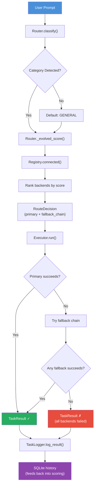
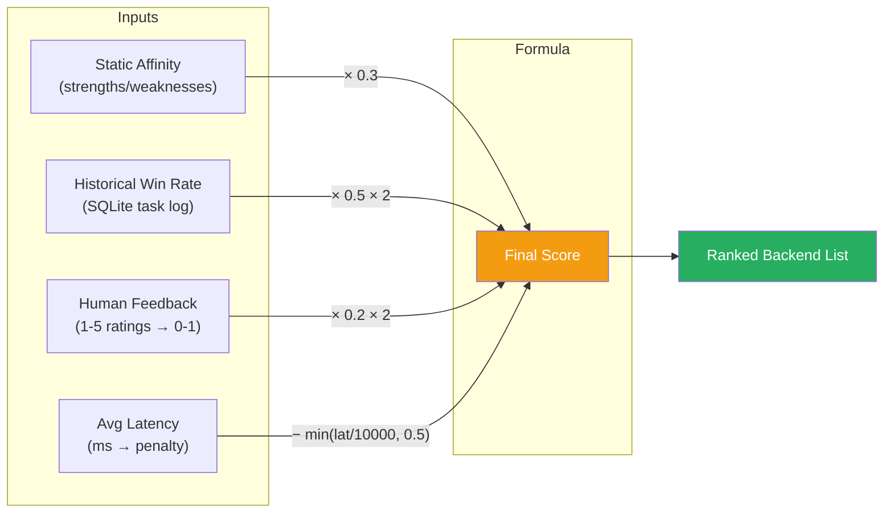
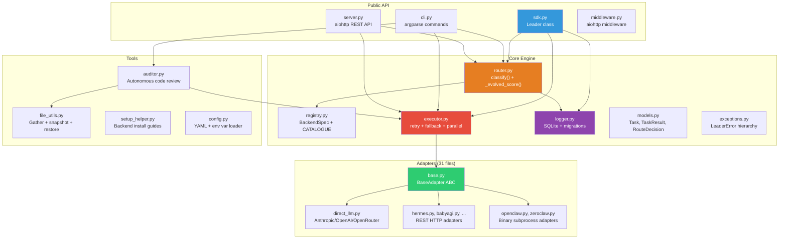
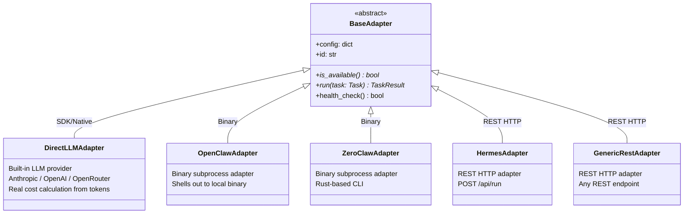
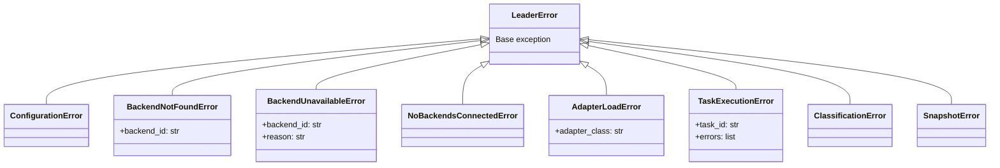
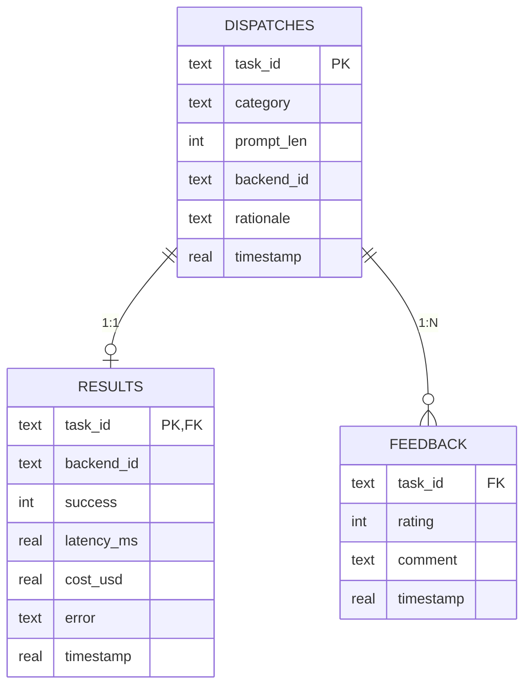

# Architecture

> System design document for the Leader routing engine.
> Last updated: v0.2.0

---

## Overview

Leader is a **credential-aware task router** that classifies incoming prompts, scores available backends using a hybrid evolutionary algorithm, and dispatches tasks with automatic fallback and retry logic. It sits above agent platforms (AutoGen, CrewAI, OpenClaw), LLM providers (Anthropic, OpenAI), and automation tools (n8n, Zapier).

---

## Dispatch Pipeline



---

## Scoring Algorithm

The router uses a **three-component hybrid score** that evolves with usage:



| Component | Weight | Data Source | Fallback |
|-----------|--------|-------------|----------|
| Historical Win Rate | 50% | `TaskLogger.win_rates()` → SQLite | Uses static score if no history |
| Static Affinity | 30% | `BackendSpec.strengths` / `.weaknesses` | Always available |
| Human Feedback | 20% | `TaskLogger.feedback_scores()` → SQLite | Uses static score if no feedback |
| Latency Penalty | −0.5 max | `TaskLogger.avg_latency()` → SQLite | 0 if no data |

---

## Component Architecture



---

## Adapter Type Hierarchy



---

## Exception Hierarchy



---

## Data Model



---

## Retry & Side-Effect Safety

The executor implements **smart retry logic** with safety guards:

| Behaviour | Condition |
|-----------|-----------|
| **Retry with backoff** | Transient errors (`TimeoutError`, `ConnectionError`, `OSError`) on safe categories |
| **Fail immediately** | Programming errors (`TypeError`, `ValueError`, `KeyError`) |
| **Never retry** | Tasks in `MESSAGING` or `AUTOMATION` categories (side-effect risk) |
| **Max attempts** | 3 retries with exponential backoff (1.0s × 1.5^attempt) |

---

## Key Design Decisions

| Decision | Rationale |
|----------|-----------|
| `uuid4` for `task_id` | Millisecond timestamps collide under parallel execution |
| Deep copy of `CATALOGUE` in Registry | Prevents tests and concurrent users from mutating shared state |
| TF-IDF bi-gram classifier | Compound phrases ("bug report") must outweigh single keywords ("write") |
| Suppression penalties | Prevents cross-category false positives (e.g. "write code" ≠ CREATIVE) |
| 50/30/20 scoring blend | Balances learning from history with static knowledge and human override |
| Path traversal checks | `restore_snapshot` validates all paths resolve within the project root |
| Side-effect category guard | MESSAGING/AUTOMATION tasks never retry to prevent duplicate delivery |
| Structured exception hierarchy | All errors use typed exceptions for safe programmatic error handling |

---

## Directory Structure

```
LEADER/
├── leader/                          # Main package
│   ├── __init__.py                  # Public API + version
│   ├── models.py                    # Task, TaskResult, RouteDecision
│   ├── exceptions.py                # LeaderError hierarchy
│   ├── router.py                    # Semantic classifier + evolved scoring
│   ├── registry.py                  # 30-backend catalogue + Registry
│   ├── executor.py                  # Dispatch + retry + fallback + parallel
│   ├── logger.py                    # SQLite persistence + migrations
│   ├── config.py                    # YAML + env var config loader
│   ├── sdk.py                       # Leader class (SDK entry point)
│   ├── cli.py                       # CLI commands
│   ├── server.py                    # aiohttp REST API
│   ├── middleware.py                # Drop-in aiohttp middleware
│   ├── auditor.py                   # Autonomous code review engine
│   ├── file_utils.py                # Codebase gathering + snapshots
│   ├── setup_helper.py              # Backend installation guides
│   ├── conftest.py                  # Shared test fixtures
│   ├── adapters/                    # 31 backend adapters
│   │   ├── base.py                  # BaseAdapter ABC
│   │   ├── direct_llm.py            # Built-in LLM adapter
│   │   └── ...                      # REST + binary adapters
│   └── plugins/                     # OpenClaw skill + webhooks
├── bridges/
│   └── agent_bridge.py              # FastAPI mock bridge for testing
├── .github/
│   ├── workflows/ci.yml             # Test + lint + security CI
│   └── workflows/publish.yml        # PyPI publish on release
├── pyproject.toml                   # Package metadata + tool config
├── Dockerfile                       # Container deployment
├── docker-compose.yml               # Leader API container
└── docker-compose.adapters.yml      # Adapter backend containers
```
