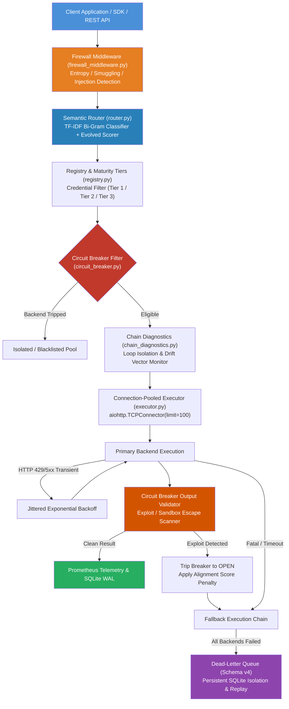
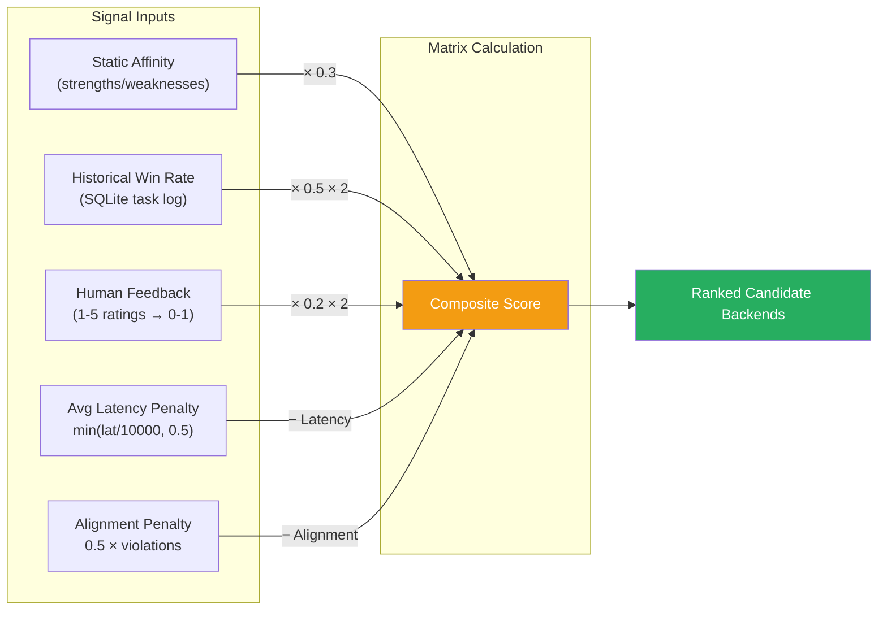
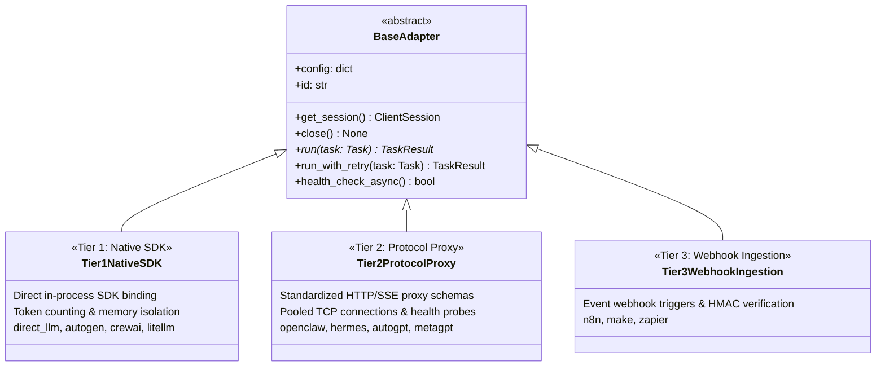
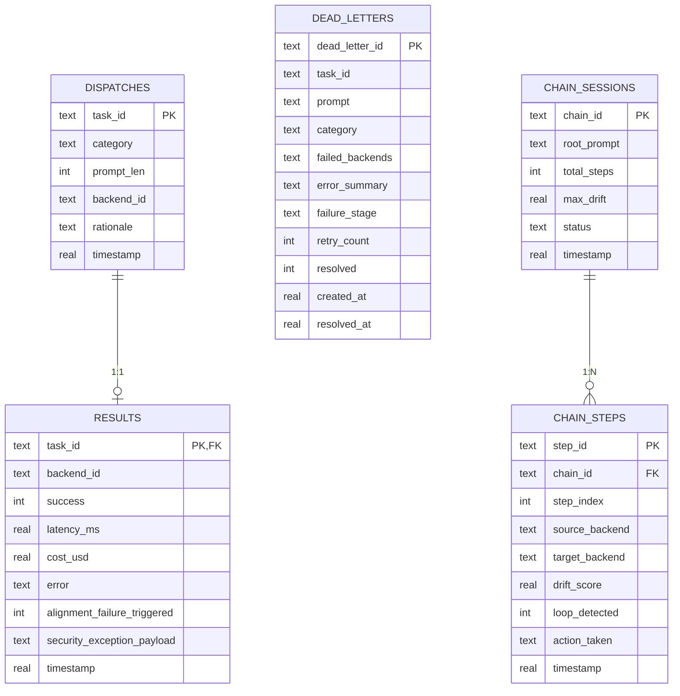

# Architecture & System Design Specification

> Comprehensive system architecture and dataflow specification for the Leader routing, safety, and orchestration platform.  
> **Version:** 1.0.0-enterprise  
> **Maintainer:** Pradeep Kumar (Krish) (`pradeepkumar.workai@gmail.com`)  

---

## 1. High-Level Architecture

Leader operates as a high-throughput, low-latency control plane positioned between client applications (SDK, REST API, CLI, AutoGen/CrewAI bridges) and upstream AI backends.


```mermaid
flowchart TD
    User["Client Application / SDK / REST API"] --> FW["Firewall Middleware (firewall_middleware.py)\nEntropy / Smuggling / Injection Detection"]
    
    FW --> Router["Semantic Router (router.py)\nTF-IDF Bi-Gram Classifier + Evolved Scorer"]
    
    Router --> Registry["Registry & Maturity Tiers (registry.py)\nCredential Filter (Tier 1 / Tier 2 / Tier 3)"]
    
    Registry --> BreakerCheck{"Circuit Breaker Filter\n(circuit_breaker.py)"}
    BreakerCheck -->|Backend Tripped| Isolated["Isolated / Blacklisted Pool"]
    BreakerCheck -->|Eligible| ChainMonitor["Chain Diagnostics (chain_diagnostics.py)\nLoop Isolation & Drift Vector Monitor"]
    
    ChainMonitor --> Dispatcher["Connection-Pooled Executor (executor.py)\naiohttp.TCPConnector(limit=100)"]
    
    Dispatcher --> Primary["Primary Backend Execution"]
    Primary -->|HTTP 429/5xx Transient| RetryBackoff["Jittered Exponential Backoff"]
    RetryBackoff --> Primary
    
    Primary --> CBValidator["Circuit Breaker Output Validator\nExploit / Sandbox Escape Scanner"]
    
    CBValidator -->|Clean Result| SuccessHandler["Prometheus Telemetry & SQLite WAL"]
    CBValidator -->|Exploit Detected| TripBreaker["Trip Breaker to OPEN\nApply Alignment Score Penalty"]
    TripBreaker --> FallbackChain["Fallback Execution Chain"]
    
    Primary -->|Fatal / Timeout| FallbackChain
    FallbackChain -->|All Backends Failed| DLQ["Dead-Letter Queue (Schema v4)\nPersistent SQLite Isolation & Replay"]

    style User fill:#4A90D9,color:#fff
    style FW fill:#E67E22,color:#fff
    style Router fill:#2980B9,color:#fff
    style BreakerCheck fill:#C0392B,color:#fff
    style CBValidator fill:#D35400,color:#fff
    style SuccessHandler fill:#27AE60,color:#fff
    style DLQ fill:#8E44AD,color:#fff
```

---

## 2. Dispatch Pipeline & Evolved Scoring

The routing matrix computes composite affinities per backend:

$$\text{Score} = 0.3 \times \text{StaticAffinity} + 0.5 \times (\text{WinRate} \times 2) + 0.2 \times (\text{Feedback} \times 2) - \text{LatencyPenalty} - \text{AlignmentPenalty}$$


```mermaid
flowchart LR
    subgraph Signal Inputs
        S["Static Affinity\n(strengths/weaknesses)"]
        W["Historical Win Rate\n(SQLite task log)"]
        F["Human Feedback\n(1-5 ratings → 0-1)"]
        L["Avg Latency Penalty\nmin(lat/10000, 0.5)"]
        A["Alignment Penalty\n0.5 × violations"]
    end

    subgraph Matrix Calculation
        S -->|"× 0.3"| SCORE
        W -->|"× 0.5 × 2"| SCORE
        F -->|"× 0.2 × 2"| SCORE
        L -->|"− Latency"| SCORE
        A -->|"− Alignment"| SCORE
    end

    SCORE["Composite Score"] --> R["Ranked Candidate Backends"]

    style SCORE fill:#F39C12,color:#fff
    style R fill:#27AE60,color:#fff
```

---

## 3. Adapter Maturity Tiers & Connection Pooling

All 30+ catalogue integrations inherit from `BaseAdapter` and are classified into distinct tiers:


```mermaid
classDiagram
    class BaseAdapter {
        <<abstract>>
        +config: dict
        +id: str
        +get_session() ClientSession
        +close() None
        +run(task: Task)* TaskResult
        +run_with_retry(task: Task) TaskResult
        +health_check_async() bool
    }

    class Tier1NativeSDK {
        <<Tier 1: Native SDK>>
        Direct in-process SDK binding
        Token counting & memory isolation
        direct_llm, autogen, crewai, litellm
    }

    class Tier2ProtocolProxy {
        <<Tier 2: Protocol Proxy>>
        Standardized HTTP/SSE proxy schemas
        Pooled TCP connections & health probes
        openclaw, hermes, autogpt, metagpt
    }

    class Tier3WebhookIngestion {
        <<Tier 3: Webhook Ingestion>>
        Event webhook triggers & HMAC verification
        n8n, make, zapier
    }

    BaseAdapter <|-- Tier1NativeSDK
    BaseAdapter <|-- Tier2ProtocolProxy
    BaseAdapter <|-- Tier3WebhookIngestion
```

---

## 4. Multi-Agent Loop Isolation & Semantic Drift Diagnostics

Multi-agent execution chains (`leader.run_chain`) are evaluated by `ChainMonitor`:

```
Step 0 (User Prompt) ───► Root Embedding ─────────────┐
                                                      │ (Cosine Distance)
Step 1 (Agent A)    ───► Step 1 Embedding ────────────┼──► Drift Score = 0.08 (OK)
                                                      │
Step 2 (Agent B)    ───► Step 2 Embedding ────────────┼──► Drift Score = 0.19 (OK)
                                                      │
Step 3 (Agent A)    ───► Jaccard N-Gram / Hash ───────┼──► Loop Detected (Ping-Pong) ──► TERMINATE_LOOP
                                                      │
Step 4 (Rogue Hop)  ───► Step 4 Embedding ────────────┴──► Drift Score = 0.84 (>0.75) ─► TERMINATE_DRIFT
```

---

## 5. Enterprise Observability & Dead-Letter Queue (DLQ)

### 5.1. Prometheus & OpenTelemetry Stack
- **Prometheus Exporter (`/metrics`)**: Exposes request rates, latencies, circuit breaker trips, drift scores, and dead letter counts.
- **OpenTelemetry Tracing (`trace_span`)**: Context manager emitting structured spans with duration and error metadata.

### 5.2. SQLite Schema v4 Data Model

```mermaid
erDiagram
    DISPATCHES {
        text task_id PK
        text category
        int prompt_len
        text backend_id
        text rationale
        real timestamp
    }

    RESULTS {
        text task_id PK, FK
        text backend_id
        int success
        real latency_ms
        real cost_usd
        text error
        int alignment_failure_triggered
        text security_exception_payload
        real timestamp
    }

    DEAD_LETTERS {
        text dead_letter_id PK
        text task_id
        text prompt
        text category
        text failed_backends
        text error_summary
        text failure_stage
        int retry_count
        int resolved
        real created_at
        real resolved_at
    }

    CHAIN_SESSIONS {
        text chain_id PK
        text root_prompt
        int total_steps
        real max_drift
        text status
        real timestamp
    }

    CHAIN_STEPS {
        text step_id PK
        text chain_id FK
        int step_index
        text source_backend
        text target_backend
        real drift_score
        int loop_detected
        text action_taken
        real timestamp
    }

    DISPATCHES ||--o| RESULTS : "1:1"
    CHAIN_SESSIONS ||--o{ CHAIN_STEPS : "1:N"
```
